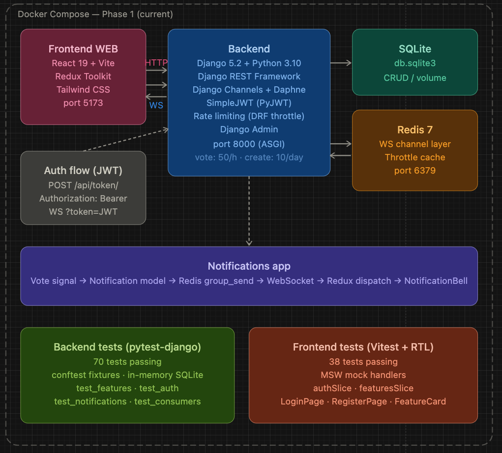
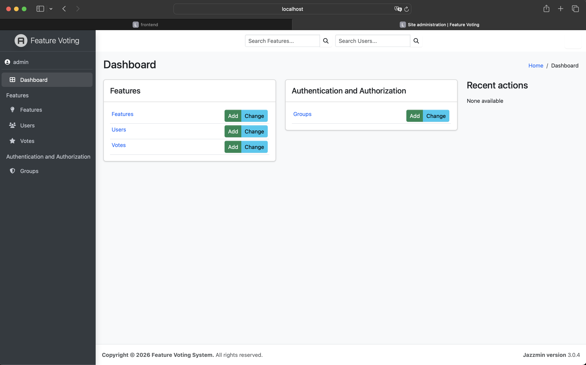

# Feature Voting System

A full-stack application where users submit feature requests, vote on them, and receive real-time notifications when someone votes on their feature.

---

## Screenshots





---

## Stack

| Layer | Technology |
|---|---|
| Backend | Django 5 + Django REST Framework |
| Auth | JWT via `djangorestframework-simplejwt` |
| Real-time | Django Channels 4 + Daphne (ASGI) |
| Channel layer | Redis 7 |
| Frontend | React 18 + Redux Toolkit + Vite |
| Styling | Tailwind CSS |
| Container | Docker Compose |

---

## Architecture overview

```
Browser
  │
  ├── HTTP  →  Daphne (port 8000)  →  Django REST Framework
  │                                        ├── features app   (CRUD + voting)
  │                                        └── notifications app (REST endpoints)
  │
  └── WS    →  Daphne (port 8000)  →  Django Channels
                                           └── NotificationConsumer
                                                 └── Redis channel layer
                                                       ↑
                                               post_save signal on Vote
```

When a user votes on a feature:
1. Django saves the `Vote` row
2. A `post_save` signal creates a `Notification` for the feature author
3. The signal pushes the notification to Redis group `user_{author_id}` via `async_to_sync(channel_layer.group_send)`
4. The author's WebSocket consumer receives it and forwards it to the browser
5. The Redux store prepends it to `notifications.items` and increments `unreadCount`
6. The bell badge updates immediately

---

## Project structure

```
feature-voting-system/
├── docker-compose.yml
├── backend/
│   ├── Dockerfile
│   ├── entrypoint.sh          # migrate → seed → daphne
│   ├── requirements.txt
│   ├── core/
│   │   ├── settings.py
│   │   ├── urls.py
│   │   └── asgi.py            # ProtocolTypeRouter (HTTP + WS)
│   ├── features/
│   │   ├── models.py          # User, Feature, Vote
│   │   ├── serializers.py
│   │   ├── views.py           # FeatureViewSet, AuthViewSet
│   │   ├── throttling.py      # VoteRateThrottle, FeatureCreateRateThrottle
│   │   ├── urls.py
│   │   └── admin.py           # Jazzmin-styled admin
│   ├── notifications/
│   │   ├── models.py          # Notification
│   │   ├── serializers.py
│   │   ├── views.py           # NotificationViewSet
│   │   ├── urls.py
│   │   ├── consumers.py       # NotificationConsumer (WebSocket)
│   │   ├── routing.py         # ws/notifications/
│   │   ├── signals.py         # post_save on Vote → notify + push
│   │   └── apps.py            # registers signals via ready()
│   ├── docs/
│   │   └── urls.md            # full API reference
│   ├── seeders/
│   └── tests/
└── frontend/
    ├── src/
    │   ├── api/
    │   │   └── axios.js       # base client, JWT interceptors, auto-refresh
    │   ├── store/
    │   │   ├── index.js
    │   │   └── slices/
    │   │       ├── authSlice.js
    │   │       ├── featuresSlice.js
    │   │       └── notificationsSlice.js
    │   ├── hooks/
    │   │   ├── useAuth.js
    │   │   ├── useFeatures.js
    │   │   └── useWebSocket.js   # WS lifecycle, auto-reconnect
    │   ├── components/
    │   │   ├── Navbar.jsx
    │   │   ├── FeatureCard.jsx
    │   │   ├── NotificationBell.jsx
    │   │   └── ProtectedRoute.jsx
    │   └── pages/
    │       ├── FeaturesPage.jsx
    │       ├── FeatureDetailPage.jsx
    │       ├── LoginPage.jsx
    │       └── RegisterPage.jsx
    └── ...
```

---

## Running locally

**Prerequisites:** Docker and Docker Compose installed.

```bash
git clone <repo>
cd feature-voting-system
docker compose up --build
```

| Service | URL |
|---|---|
| Frontend | http://localhost:5173 |
| Backend API | http://localhost:8000/api/ |
| Django Admin | http://localhost:8000/admin/ |
| WebSocket | ws://localhost:8000/ws/notifications/?token=\<access\> |

On first boot `entrypoint.sh` automatically:
1. Runs `python manage.py migrate`
2. Creates an admin superuser (`admin` / `admin123`) if it doesn't exist
3. Runs the seeders to populate sample data
4. Runs `collectstatic` (served by WhiteNoise)
5. Starts the Daphne ASGI server

---

## Default credentials

| Role | Username | Password |
|---|---|---|
| Admin | `admin` | `admin123` |

The Django admin panel is at `/admin/`. From there you can manage users, features, votes, and notifications, and use the bulk actions (`Mark as planned`, `Mark as rejected`) on features.

---

## Authentication flow

```
Register / Login
      │
      ▼
POST /api/token/  or  POST /api/auth/register/
      │
      ▼
{ access, refresh }  →  stored in localStorage
      │
      ▼
All API requests: Authorization: Bearer <access>
      │
      ├── 401 on non-auth endpoint?
      │     └── POST /api/token/refresh/
      │           ├── ok  → retry original request
      │           └── fail → logout + retry without token (public endpoints still work)
      │
      └── 401 on /api/token/ itself? → wrong credentials, no retry
```

Access tokens are short-lived. The Axios interceptor handles silent refresh automatically. On logout, both tokens are removed from `localStorage` and the WebSocket connection is closed.

---

## WebSocket connection

`useWebSocket()` is called at the app root (inside `BrowserRouter`). It:

- Connects when `isAuthenticated === true`, passes the JWT access token in the query string: `?token=<access>`
- The server validates the token and adds the socket to group `user_{id}`
- Dispatches `addNotification` on incoming messages
- Auto-reconnects after 3 seconds if the connection drops
- Disconnects and cleans up on logout or component unmount

---

## Features

### Feature requests
- Browse all feature requests — no login required
- Search by title or description (debounced, 400 ms)
- Sort by: Most voted · Least voted · Newest · Oldest (pill buttons, mobile-friendly)
- Paginated list (10 per page) with numbered pagination
- Vote / unvote on features (authenticated, cannot vote on own features)
- Submit new feature requests (authenticated)
- Delete own features (with inline confirmation)
- Rank badge: gold (1st), silver (2nd), bronze (3rd)
- Feature status badges: open · planned · in progress · completed · rejected

### Notifications
- Real-time bell with unread count badge
- Dropdown (mobile-safe, fixed positioning on narrow screens)
- Infinite scroll inside the dropdown — loads more as you scroll
- "Mark all as read" button
- Notifications created automatically when someone votes on your feature (self-votes excluded)

### Admin
- Styled with [Jazzmin](https://django-jazzmin.readthedocs.io/) — indigo theme, Font Awesome icons
- Manage users, features, votes, notifications
- Bulk actions: mark features as planned / rejected
- Inline vote count display per feature

### Rate limiting
- Vote: max 50 votes/hour per user (429 with `Retry-After` header)
- Feature create: max 10 features/day per user
- Backed by Redis cache — persists across restarts and multiple workers
- Frontend shows a dismissable banner with the exact wait time on 429

---

## Running tests

```bash
# Backend tests (pytest)
docker-compose exec backend pytest tests/ -v

# Frontend tests (vitest)
docker-compose exec frontend npm test
```

Tests cover auth (register, login, token refresh), features (CRUD, permissions, pagination, search, ordering), and votes (cast, duplicate, self-vote, remove).

---

## API reference

See [`backend/docs/urls.md`](backend/docs/urls.md) for the full endpoint reference including request/response shapes, status codes, and business rules.
